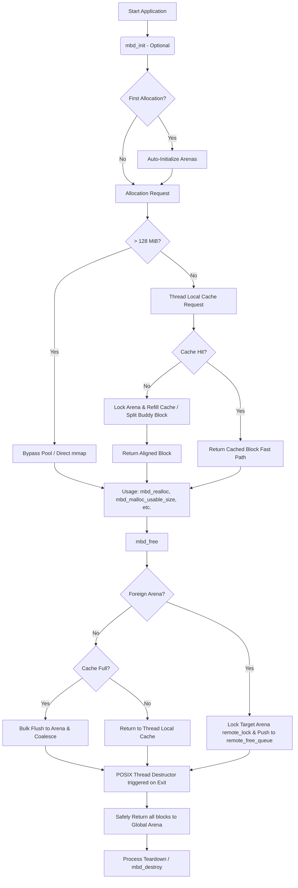

<div align="center">
  
</div>

**High-performance lock-free thread-caching buddy allocator for C/C++.** (v1.4.4)

MyBuddy (MBd) is a production-grade, highly concurrent memory allocator for high-performance C/C++ applications. It combines the anti-fragmentation guarantees of a classic Buddy Allocator with the lock-free speed of per-thread caching. It is designed with 32-byte SIMD-safe alignment, zero thread-exit leaks, hardened safety, and is LD_PRELOAD-ready.

## Key Features

- **Fast**: Lock-free thread-local cache delivers allocations up to 8 KiB in just a few CPU cycles. Dynamic per-order cache sizing limits ensure optimal memory utilization.
- **Fully Thread-Safe**: True per-thread caching with global locks grouped and acquired only on cache misses or large blocks. ThreadSanitizer (TSAN) clean, utilizing safe `_Atomic` lock-free checks across the header to eliminate concurrent coalescing race conditions. Includes a robust mutex-protected remote free queue for cross-arena allocations.
- **Hardened & Safe**: Double-free protection, underflow-protected bounds checking, check-summed magic-value validation using a global randomized XOR entropy key to mitigate heap corruption, and defused memalign exploits.
- **Memory Efficient**: Uses `MAP_NORESERVE` so virtual memory is only backed by physical RAM when used. High-order blocks (>2 MiB) are safely returned to the OS via `madvise` (`MADV_DONTNEED`) to prevent memory hoarding, while selectively applying `MADV_HUGEPAGE` and `MADV_DONTDUMP` to long-lived arena mappings. Includes in-place coalescing in `mbd_realloc` to avoid unnecessary copies.
- **Advanced Alignment**: Mathematically guaranteed 32-byte minimum alignment natively, plus `mbd_memalign()` for stricter requirements like AVX-512.
- **Huge Allocations**: Requests over 128 MiB seamlessly bypass the buddy pool and use tracked direct `mmap()`/`munmap()`, skipping redundant `memset` zeroing in `mbd_calloc` for directly-mapped blocks.
- **Zero Thread-Exit Leaks**: Completely reclaims dead thread caches safely using POSIX thread destructors instead of racy liveness heuristics.
- **Production Readiness**: LD_PRELOAD-safe, self-initializing, includes atomic stats tracking (`mbd_get_stats`) heavily optimized against false sharing by using 64-byte aligned per-arena structures, and custom OOM handler hooks.

## Multithreading & Concurrency

- **No False Sharing**: Thread cache data structures and heavily contended global statistics are explicitly padded and localized to 64-byte cachelines.
- **Anti-Hoarding & Thrashing Guard**: Full caches bulk-flush 50% of blocks. Mutex locks are batched during flushes to drastically reduce context switching.
- **Starvation Immunity**: If a thread's native arena runs dry, it automatically migrates and binds to an arena with available memory.

## Usage Scenarios

- **Tiny/Medium objects** (strings, ECS entities, 4 KiB pages): Stay in the lock-free cache thanks to `SMALL_ORDER_MAX = 13`.
- **Large objects** (8 KiB – 128 MiB): Handled by the global buddy path (fast O(1) doubly-linked list traversal).
- **Massive objects** (> 128 MiB): Seamlessly routed to direct OS mmaps.

## Library Lifecycle



## Quick Start

MyBuddy is a single-header library. To use it, you just need to include the header. However, exactly **one** C or C++ file in your project must define `MYBUDDY_IMPLEMENTATION` before including the header to instantiate the implementation.

### Implementation File (`mybuddy.c` or similar):
```c
#define MYBUDDY_IMPLEMENTATION
#include "mybuddy.h"
```

### Other Files:
```c
#include "mybuddy.h"

int main() {
    // Lock-free fast path (falls under SMALL_ORDER_MAX)
    char *string_buffer = mbd_alloc(128);

    // AVX-512 strict alignment
    float *simd_data = mbd_memalign(64, 1024 * sizeof(float));

    // Huge allocation (bypasses buddy pool, uses direct mmap)
    void *massive_asset = mbd_alloc(1024 * 1024 * 256);

    mbd_free(string_buffer);
    mbd_free(simd_data);
    mbd_free(massive_asset);

    // Fetch accurate diagnostics
    mbd_stats_t stats = mbd_get_stats();

    mbd_destroy(); // Safe here, no other threads running
    return 0;
}
```

### Cross-thread Stress testing
If you want to run extensive tests with multithreaded extreme load cases, the test suite includes `test_multithread_stress.c` covering TSAN / ASAN validation on 16 threads cross-freeing millions of blocks dynamically.

Use `make test` inside the project to automatically run the suite!

*Note: The allocator is self-initializing. The first call to `mbd_alloc()` or `mbd_free()` will automatically initialize the pool. For latency-sensitive applications, you may still call `mbd_init()` explicitly during startup.*

## API Reference

### Core Memory Operations
- `void mbd_init(void);`
  Explicitly initializes the allocator. Optional, as the library is self-initializing.
- `void mbd_destroy(void);`
  Destroys the allocator and unmaps all arenas. Strictly for unit-testing and clean process teardown.
- `void *mbd_alloc(size_t requested_size);`
  Allocates a block of memory of the specified size. Returns a 32-byte aligned pointer.
- `void mbd_free(void *ptr);`
  Frees a previously allocated block of memory. Includes bounds checking and double-free protection.
- `void *mbd_realloc(void *ptr, size_t new_size);`
  Reallocates a memory block to a new size.
- `void *mbd_calloc(size_t nmemb, size_t size);`
  Allocates zero-initialized memory for an array.
- `void *mbd_memalign(size_t alignment, size_t size);`
  Allocates memory with a specific alignment (e.g., for AVX-512).
- `size_t mbd_malloc_usable_size(const void *ptr);`
  Returns the number of usable bytes in an allocated block.
- `mbd_stats_t mbd_get_stats(void);`
  Returns accurate diagnostics of mapped, allocated, and free bytes.
- `void mbd_set_oom_handler(void (*handler)(void));`
  Sets a custom Out-Of-Memory handler hook.
- `void mbd_set_profiler_hook(void (*hook)(mbd_event_type_t, void*, size_t));`
  Sets a custom profiler hook.
- `void mbd_trim(void);`
  Forces a trim of all thread caches, returning memory to the global arena.
- `void mbd_dump(void);`
  Prints the current state of the global free lists for diagnostics.

## Compilation / Linking

When compiling your application, ensure you link against the pthread library:
```bash
gcc -o my_app main.c mybuddy.c -lpthread
```
