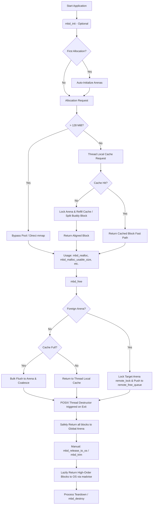

<div align="center">
  
</div>

**High-performance lock-free thread-caching buddy allocator for C/C++.** (v1.5.0-RC3)

MyBuddy (MBd) is a production-grade, highly concurrent memory allocator for high-performance C/C++ applications. It combines the anti-fragmentation guarantees of a classic Buddy Allocator with the lock-free speed of per-thread caching. It is designed with 32-byte SIMD-safe alignment, zero thread-exit leaks, hardened safety, and is LD_PRELOAD-ready.

## Key Features

- **Fast**: Lock-free thread-local cache delivers allocations up to 1 MiB in just a few CPU cycles, massively boosting performance for large operations. Dynamic per-order cache sizing limits ensure optimal memory utilization.
- **Lock-Free Fast Paths**: Features atomic, non-blocking pre-checks for cross-arena queue draining, virtually eliminating uncontended mutex overhead.
- **Fully Thread-Safe**: True per-thread caching with global locks grouped and acquired only on cache misses or large blocks. ThreadSanitizer (TSAN) clean, utilizing safe `_Atomic` lock-free checks across the header to eliminate concurrent coalescing race conditions. Includes a robust mutex-protected remote free queue for cross-arena allocations.
- **Hardened & Safe**: Double-free protection, underflow-protected bounds checking, check-summed magic-value validation using a global randomized XOR entropy key to mitigate heap corruption, and defused memalign exploits.
- **Memory Efficient**: Uses `MAP_NORESERVE` so virtual memory is only backed by physical RAM when used. High-order blocks (>2 MiB) are safely returned to the OS via an explicit `mbd_release_to_os()` call, which utilizes `madvise` (preferring `MADV_FREE` on Linux, falling back to `MADV_DONTNEED`) to lazily release memory while keeping the buddy pool warm to prevent hard page fault cascades on re-allocation. Includes in-place coalescing in `mbd_realloc` to avoid unnecessary copies.
- **Advanced Alignment**: Mathematically guaranteed 32-byte minimum alignment natively, plus `mbd_memalign()` for stricter requirements like AVX-512.
- **Huge Allocations**: Requests over 128 MiB seamlessly bypass the buddy pool and use tracked direct `mmap()`/`munmap()`, skipping redundant `memset` zeroing in `mbd_calloc` for directly-mapped blocks.
- **Zero Thread-Exit Leaks**: Completely reclaims dead thread caches safely using POSIX thread destructors instead of racy liveness heuristics.
- **Production Readiness**: LD_PRELOAD-safe, self-initializing, includes atomic stats tracking (`mbd_get_stats`) heavily optimized against false sharing by using 64-byte aligned per-arena structures, and custom OOM handler hooks.

## Multithreading & Concurrency

- **No False Sharing**: Thread cache data structures and heavily contended global statistics are explicitly padded and localized to 64-byte cachelines.
- **Anti-Hoarding & Thrashing Guard**: Full caches bulk-flush 50% of blocks. Mutex locks are batched during flushes to drastically reduce context switching.
- **Starvation Immunity**: If a thread's native arena runs dry, it automatically migrates and binds to an arena with available memory.

## Usage Scenarios

- **Tiny/Medium objects** (strings, ECS entities, 4 KiB pages): Stay in the lock-free cache thanks to `SMALL_ORDER_MAX` (defaults to 16).
- **Large objects** (8 KiB – 128 MiB): Handled by the global buddy path (fast O(1) doubly-linked list traversal).
- **Massive objects** (> 128 MiB): Seamlessly routed to direct OS mmaps.

## Library Lifecycle



## Quick Start

MyBuddy is a single-header library. To use it, you just need to include the header. However, exactly **one** C or C++ file in your project must define `MYBUDDY_IMPLEMENTATION` before including the header to instantiate the implementation.

### Implementation File (`mybuddy.c` or similar):
```c
#define MYBUDDY_IMPLEMENTATION
#include "mybuddy.h"
```

### Other Files:
```c
#include "mybuddy.h"

int main() {
    // Lock-free fast path (falls under SMALL_ORDER_MAX)
    char *string_buffer = mbd_alloc(128);

    // AVX-512 strict alignment
    float *simd_data = mbd_memalign(64, 1024 * sizeof(float));

    // Huge allocation (bypasses buddy pool, uses direct mmap)
    void *massive_asset = mbd_alloc(1024 * 1024 * 256);

    mbd_free(string_buffer);
    mbd_free(simd_data);
    mbd_free(massive_asset);

    // Fetch accurate diagnostics
    mbd_stats_t stats = mbd_get_stats();

    mbd_destroy(); // Safe here, no other threads running
    return 0;
}
```

### Cross-thread Stress testing
If you want to run extensive tests with multithreaded extreme load cases, the test suite includes `test_multithread_stress.c` covering TSAN / ASAN validation on 16 threads cross-freeing millions of blocks dynamically.

Use `make test` inside the project to automatically run the suite!

*Note: The allocator is self-initializing. The first call to `mbd_alloc()` or `mbd_free()` will automatically initialize the pool. For latency-sensitive applications, you may still call `mbd_init()` explicitly during startup.*

## Configuration Settings

The allocator can be configured globally by passing an `mbd_config_t` struct to `mbd_init`. If passed as `NULL`, or if the allocator auto-initializes, safe performance-oriented defaults are used.

```c
typedef struct {
    uint32_t flags;
    int arena_count;
    size_t pool_size;

    /* Order Limits */
    uint32_t min_order;           // Default: 6 (64 bytes)
    uint32_t max_order;           // Default: 27 (128 MiB)
    uint32_t small_order_max;     // Default: 20 (1 MiB)
    uint32_t large_cutoff_order;  // Default: 14 (16 KiB)

    /* Cache Sizing & Thresholds */
    uint32_t cache_limits[32];    // Max order is 31, so 32 slots is safe
    uint32_t mmap_cache_slots;    // Default: 8
    uint32_t mmap_max_waste_ratio;// Default: 4
    size_t   cache_pressure_threshold; // Default: 4 MiB

    /* Advanced Heuristics */
    uint8_t  flush_high_watermark_pct;  // Default: 100 (Flush when 100% full)
    uint8_t  flush_low_watermark_pct;   // Default: 50  (Flush down to 50%)
    uint32_t refill_batch_size;         // Default: 0 (Unlimited/Fill to max)
    uint32_t max_remote_frees_per_lock; // Default: 0 (Unlimited)
    uint32_t migration_return_freq;     // Default: 64
    size_t   hugepage_threshold;        // Default: 2097152 (2 MiB)
} mbd_config_t;
```

- **`flags`**: Bitmask for allocator flags. Available options:
  - `MBD_FLAG_HARDENED`: Enables bounds checking, XOR check-summed header validation, and double-free protection. (Disabled by default due to performance overhead).
  - `MBD_FLAG_ATOMIC_STATS`: Enables atomic tracking of stats like cache hits and misses. (Enabled by default).
  - `MBD_FLAG_REALLOC_LOCK`: Enables briefly taking the arena lock during `realloc` for possible coalescing (Enabled by default).
  - `MBD_FLAG_MADV_RELEASE`: Enables using `MADV_FREE` / `MADV_DONTNEED` to eagerly release pages to the OS. (Enabled by default).
  - `MBD_FLAG_BUDDY_LARGE`: Forces the buddy allocator to handle all allocation sizes up to max order. Disables exact-fit direct mmap. (Disabled by default).
- **`arena_count`**: The number of independent arenas to partition memory across. Defaults to the number of CPU cores minus one.
- **`pool_size`**: The total reservation capacity in bytes per arena.
- **`cache_limits`**: An array dictating the maximum number of blocks a thread cache can hold for each buddy order size. Tuned to prevent thrashing. (If array is empty, defaults are applied).
- **`mmap_max_waste_ratio`**: Controls how much larger a cached mmap block can be compared to the requested size (e.g. 4 means up to 4x). A value of 1 enforces exact-fit. A value of 0 defaults to 4.
- **`cache_pressure_threshold`**: Controls aggressive vs. lazy flushing. When a thread's total cached bytes exceed this threshold, it triggers a bulk flush. Lower values force frequent returns to the global pool (good for memory-constrained or high thread-churn environments), while higher values allow lazy hoarding for max performance. Defaults to 4 MiB.
- **`min_order`**: The minimum allocation order size handled by the buddy allocator. Defaults to 6 (64 bytes).
- **`max_order`**: The maximum allocation order size handled by the buddy allocator. Defaults to 27 (128 MiB).
- **`small_order_max`**: The maximum order size handled by the lock-free thread-local cache. Defaults to 20 (1 MiB).
- **`large_cutoff_order`**: The order size above which allocations bypass the buddy pool and use exact-fit mmap. Defaults to 14 (16 KiB).
- **`mmap_cache_slots`**: The maximum number of slots available in the thread-local mmap cache. Defaults to 8.
- **`flush_high_watermark_pct`**: The percentage of the cache limit at which a cache flush is triggered. Defaults to 100 (100%).
- **`flush_low_watermark_pct`**: The percentage of the cache limit to flush down to. Defaults to 50 (50%). These two watermark parameters dictate the dynamic bulk-flushing behavior of thread caches by setting the percentage limits relative to the configured cache limits.
- **`refill_batch_size`**: Limits the number of blocks refilled into a thread cache from an arena free list during a single lock acquisition. A value of 0 fills to the max capacity. Defaults to 0.
- **`max_remote_frees_per_lock`**: Limits the number of blocks drained from a remote free queue into an arena free list per operation to bound lock times. A value of 0 is unlimited. Defaults to 0.
- **`migration_return_freq`**: How frequently an allocation checks to return to a thread's home arena after it was forced to migrate to another. Defaults to 64.
- **`hugepage_threshold`**: Allocation sizes above this threshold will attempt to use huge pages. Defaults to 2 MiB.

## API Reference

### Core Memory Operations
- `void mbd_init(const mbd_config_t *config);`
  Explicitly initializes the allocator with an optional configuration struct (pass `NULL` for defaults). The config allows you to override total pool size, number of arenas, hardening flags (`MBD_FLAG_HARDENED`), and per-order thread cache limits.
- `void mbd_destroy(void);`
  Destroys the allocator and unmaps all arenas. Strictly for unit-testing and clean process teardown.
- `void *mbd_alloc(size_t requested_size);`
  Allocates a block of memory of the specified size. Returns a 32-byte aligned pointer.
- `void mbd_free(void *ptr);`
  Frees a previously allocated block of memory. Includes bounds checking and double-free protection.
- `void *mbd_realloc(void *ptr, size_t new_size);`
  Reallocates a memory block to a new size.
- `void *mbd_calloc(size_t nmemb, size_t size);`
  Allocates zero-initialized memory for an array.
- `void *mbd_memalign(size_t alignment, size_t size);`
  Allocates memory with a specific alignment (e.g., for AVX-512).
- `size_t mbd_malloc_usable_size(const void *ptr);`
  Returns the number of usable bytes in an allocated block.
- `mbd_stats_t mbd_get_stats(void);`
  Returns accurate diagnostics of mapped, allocated, and free bytes.
- `void mbd_set_oom_handler(void (*handler)(void));`
  Sets a custom Out-Of-Memory handler hook.
- `void mbd_set_profiler_hook(void (*hook)(mbd_event_type_t, void*, size_t));`
  Sets a custom profiler hook.
- `void mbd_release_to_os(void);`
  Explicitly returns unused high-order memory (blocks >= 2 MiB) to the operating system using `madvise`.
- `void mbd_trim(void);`
  Forces a trim of all thread caches, returning memory to the global arena, and subsequently calls `mbd_release_to_os()`.
- `void mbd_dump(void);`
  Prints the current state of the global free lists for diagnostics.

## Compilation / Linking

When compiling your application, ensure you link against the pthread library:
```bash
gcc -o my_app main.c mybuddy.c -lpthread
```
